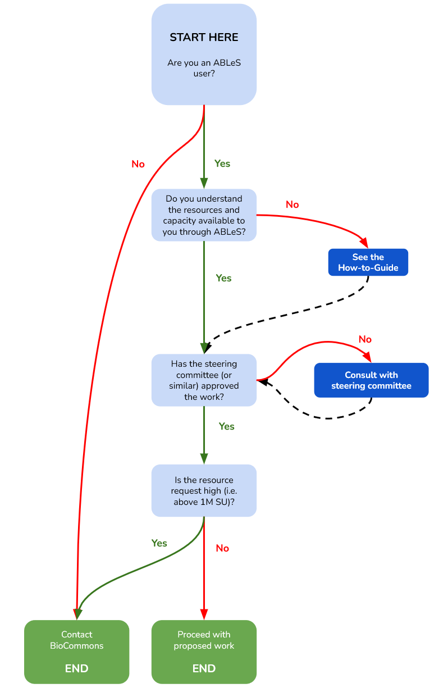

# Setting up an ABLeS community

The Australian BioCommons and the bioinformatics leads for each community have different roles in initiation, onboarding and reporting for ABLeS. 

ABLeS projects are led and maintained by their [communities](communities.md) with the support of the ABLeS team to facilitate the access to ABLeS resources. 

If you are new to ABLeS program, please follow the diagram below in order to start using ABLeS resources or **[contact us](contact-us.md)** for more information and assistance. 

## Below are more detailed responsibilities. 

|                  **Type of user** |                                                                                                                                                                                                                                                                                                        **ABLeS program set up**                                                                                                                                                                                                                                                                                                       | **During ABLeS project**                                                                                                                                                                                                                                                                                                                                                                                                                                                                                                                                                                                                                                                                                                                                                                    |
|----------------------------------|--------------------------------------------------------------------------------------------------------------------------------------------------------------------------------------------------------------------------------------------------------------------------------------------------------------------------------------------------------------------------------------------------------------------------------------------------------------------------------------------------------------------------------------------------------------------------------------------------------------------------------------|--------------------------------------------------------------------------------------------------------------------------------------------------------------------------------------------------------------------------------------------------------------------------------------------------------------------------------------------------------------------------------------------------------------------------------------------------------------------------------------------------------------------------------------------------------------------------------------------------------------------------------------------------------------------------------------------------------------------------------------------------------------------------------------------|
|                    **BioCommons** |                                                             **BioCommons will**   BioCommons initiates an ABLeS community through:  1. Creation of a project allocation at the NCI for a community  2. Inviting community bioinformatics leads to a project allocation as Chief Investigators  3. Providing information on how to utilise ABLeS resources and contribute to the shared tool and software repository.   Biocommons manage the resources available to the ABLeS programme across all active communities.                                                              | **BioCommons can assist with**  Biocommons helps communities to overcome different challenges that may appear:   1. Installing tools, software, pipelines when a special support is needed.  2. Optimising workflows and software to be used by all communities.  3. Developing and improving cross-cutting tools and workflows.  4. Managing the allocation of resources for communities.  We realise that communities will have different capabilities and different needs. Therefore, ABLeS support will adapt to suit these aspects and aim to provide the best possible support to the communities in order to do their work efficiently.                                                                                        |
| **Community bioinformatics lead** | **Community bioinformatics leads should**   1. Complete an initial quarterly poll ([link](https://docs.google.com/forms/d/e/1FAIpQLSeaJdpQXbvXYfjwXFRPAmtc0FjJEcCwplM7kCWye1DFMtgx9g/viewform?usp=sf_link)) considering the plan agreed on by the community’s steering committee. This provides the BioCommons with an idea of the aims and predicted computational requirements for your community.   2. Identify known existing challenges, that BioCommons or the NCI may be able to address and / or support as part of ABLeS. You can use the GoogleForm to let us know about these challenges.| **Community bioinformatics leads should**  1. Complete a quarterly poll ([link](https://docs.google.com/forms/d/e/1FAIpQLSeaJdpQXbvXYfjwXFRPAmtc0FjJEcCwplM7kCWye1DFMtgx9g/viewform?usp=sf_link)) considering the plan agreed on by the community’s steering committee. This provides the BioCommons with your communities expected quarterly aims and computational requirements. 2. Community bioinformatics leads manage the resources provided by ABLeS including: a) Adding members to the community projects.  b) Educating / onboarding new members on ABLeS projects. c) Contributing and / or coordinating contributions to the shared tool and software repository (if89), as well as encouraging community contribution. |
|              **Community member** |                                                                                                                                                                                                                                                                                                                                                                                                                      None                                                                                                                                                                        | **Community members should**  1. Try their best to utilise ABLeS resources efficiently  2. Help to deploy and install software, tools and workflows to the shared repository (this activity may be coordinated by the community bioinformatics leads, as needed)                                                                                                                                                                                                                                                                                                                                                                                                                                                                                |

# ABLeS milestones for 2022-2023

## Quarter 3, July, August, and September 2022

| **Activity**                                                                                                                            |           **Date**           |
|-----------------------------------------------------------------------------------------------------------------------------------------|:----------------------------:|
| ABLeS team sends a reminder to submit a quarterly plan.                                                                                 | *16th June 2022*  |
| Meeting with communities to discuss outputs of the previous quarter.                                                                    | *23rd June  2022* |
| Deadline for submitting quarterly plans by community bioinformatics lead(s).   100 KSUs will be added to each active ABLeS project. | *30th June  2022* |
| ABLeS team provides feedback on plans.                                                                                                  |  *7th July 2022*  |

## Quarter 4, October, November, and December 2022

| **Activity**                                                                                                                            |             **Date**              |
|-----------------------------------------------------------------------------------------------------------------------------------------|:---------------------------------:|
| ABLeS team sends a reminder to submit a quarterly plan.                                                                                 | *15th September 2022*  |
| Meeting with communities to discuss outputs of the previous quarter.                                                                    | *22nd September 2022* |
| Deadline for submitting quarterly plans by community bioinformatics lead(s).   100 KSUs will be added to each active ABLeS project. |       *29th September 2022*       |
| ABLeS team provides feedback on plans.                                                                                                  |        *6th October 2022*         |

## Quarter 1, January, February, and March 2023

| **Activity**                                                                                                                            |            **Date**            |
|-----------------------------------------------------------------------------------------------------------------------------------------|:------------------------------:|
| ABLeS team sends a reminder to submit a quarterly plan.                                                                                 | *1st December 2022* |
| Meeting with communities to discuss outputs of the previous quarter.                                                                    |      *8th December 2022*       |
| Deadline for submitting quarterly plans by community bioinformatics lead(s).   100 KSUs will be added to each active ABLeS project. |      *15th December2022*       |
| ABLeS team provides feedback on plans.                                                                                                  |       *7th January 2023*       |

## Quarter 2, April, May and June 2023

| **Activity**                                                                                                                            |           **Date**           |
|-----------------------------------------------------------------------------------------------------------------------------------------|:----------------------------:|
| ABLeS team sends a reminder to submit a quarterly plan.                                                                                 | *15th March 2023* |
| Meeting with communities to discuss outputs of the previous quarter.                                                                    | *22nd March 2023* |
| Deadline for submitting quarterly plans by community bioinformatics lead(s).   100 KSUs will be added to each active ABLeS project. |       *29th March 2023*        |
| ABLeS team provides feedback on plans.                                                                                                  |       *6th April 2023*       |

